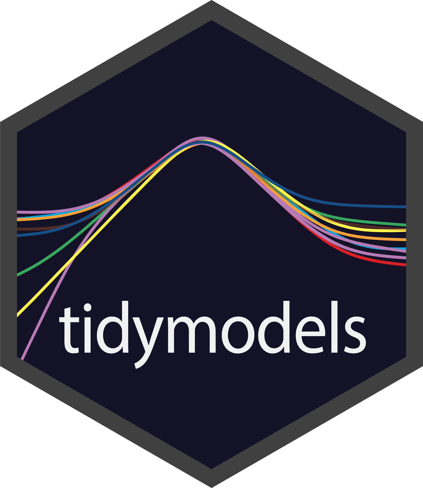
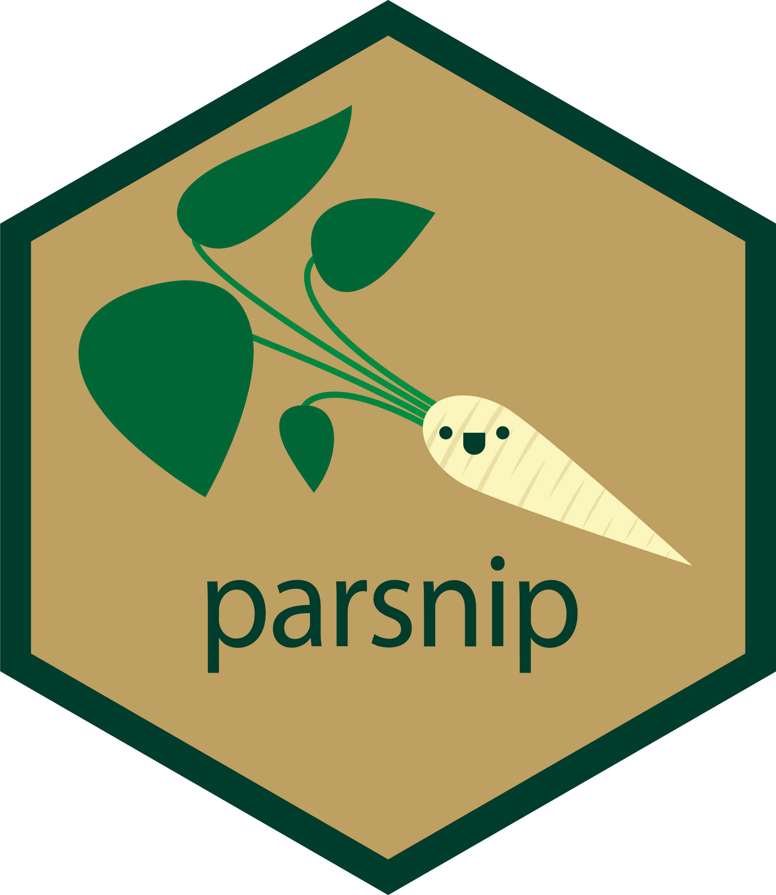
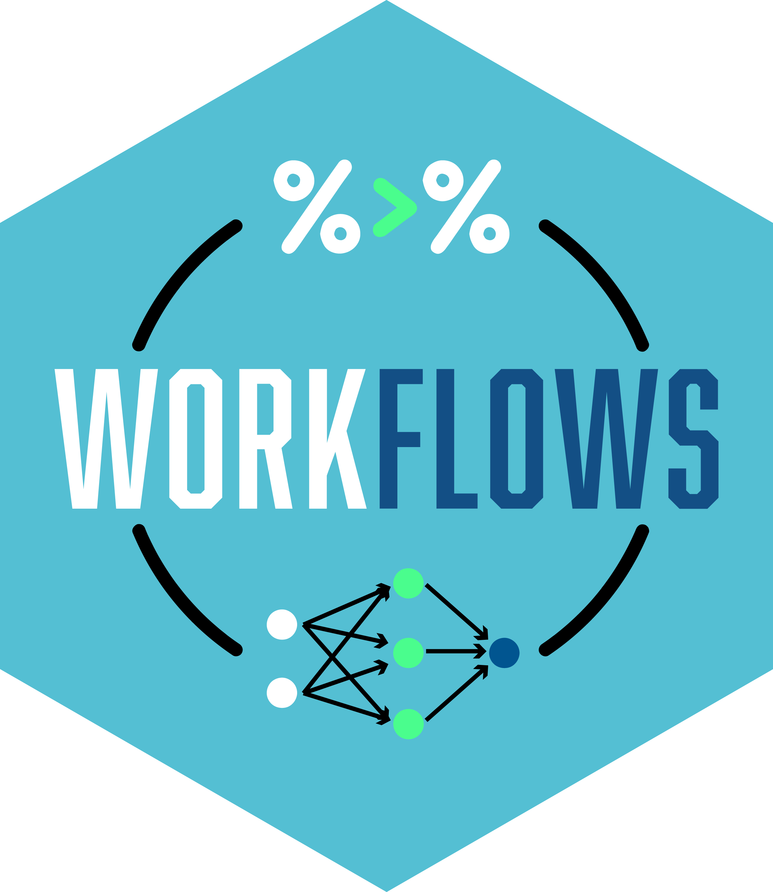
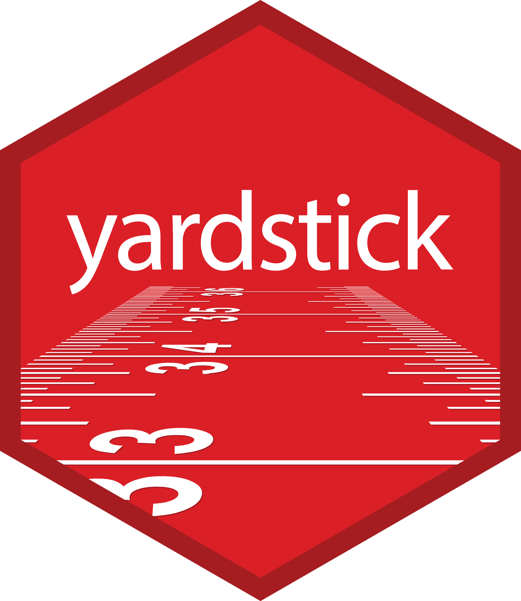
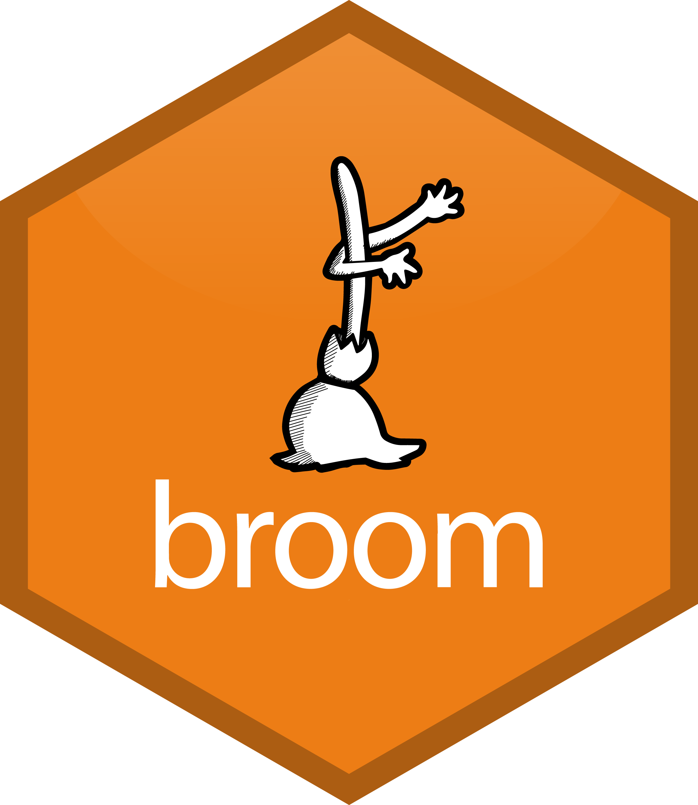
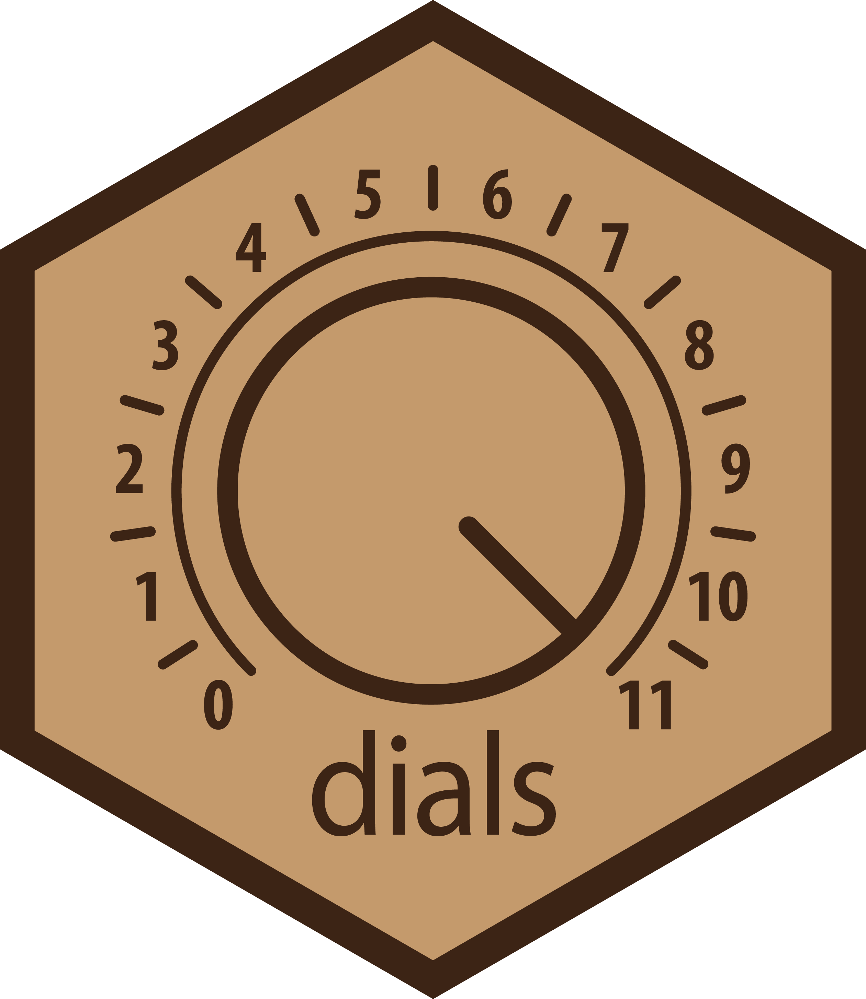
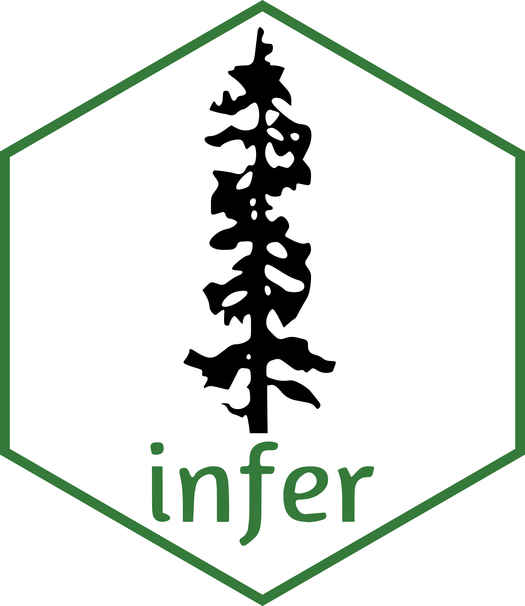
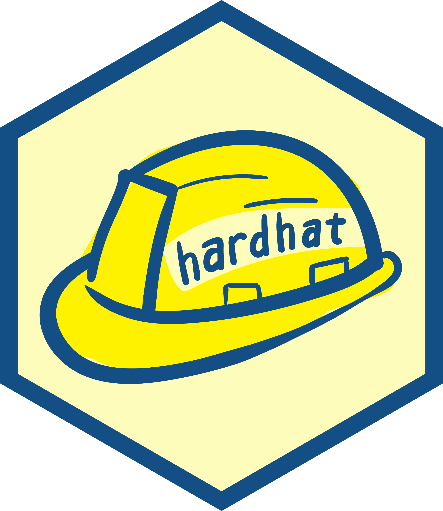
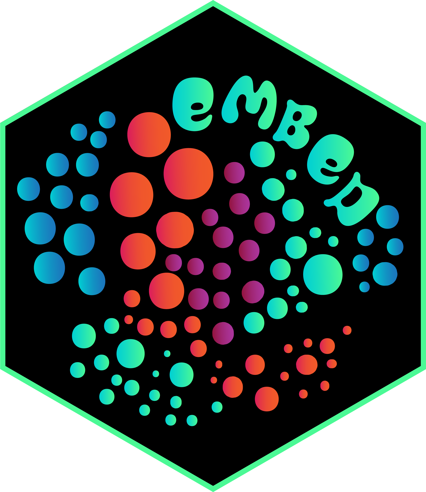
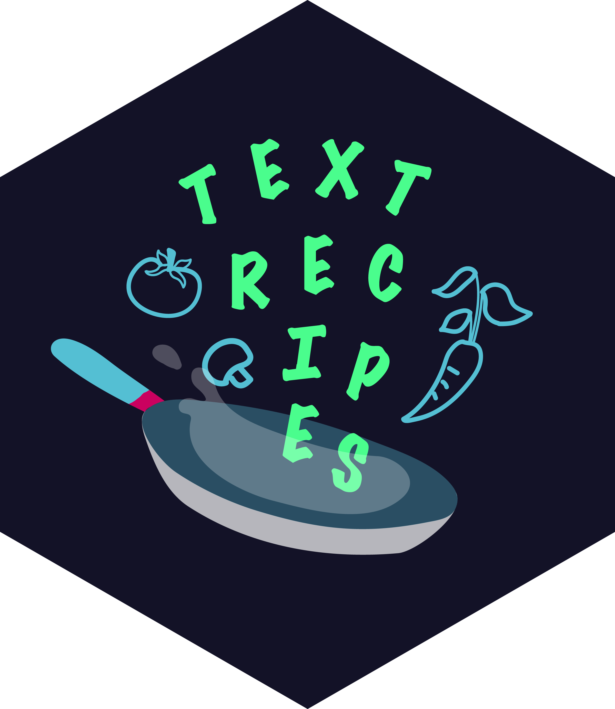

::: {.logo-collage}
{.hex-logo}
{.hex-logo}
{.hex-logo}
{.hex-logo}
{.hex-logo}
{.hex-logo}
{.hex-logo}
{.hex-logo}
{.hex-logo}
{.hex-logo}
{.hex-logo}
{.hex-logo}
{.hex-logo}
{.hex-logo}
:::

::: {.hero-section}
# Claude Code Skills for Tidymodels

Master machine learning with Tidymodels and AI-powered guidance. Whether you're building predictive models or creating packages, these skills help you follow best practices and work efficiently.

::: {.cta-container}
[Get Started →](getting-started.qmd){.btn-primary}
:::
:::

::: {.quick-links}
## Explore Skills

::: {.link-row}
::: {.link-card}
### 📊 For Analysts
Build predictive models with proper validation and best practices.

[User Skills →](users/index.qmd)
:::

::: {.link-card}
### 🔧 For Developers
Create custom metrics, preprocessing steps, and Tidymodels extensions.

[Developer Skills →](developers/index.qmd)
:::
:::
:::
